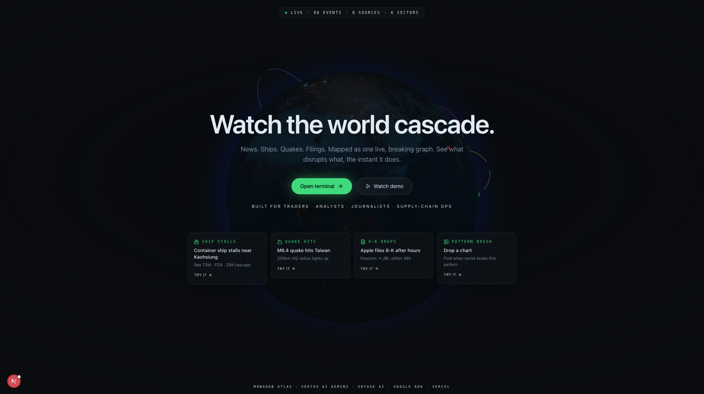
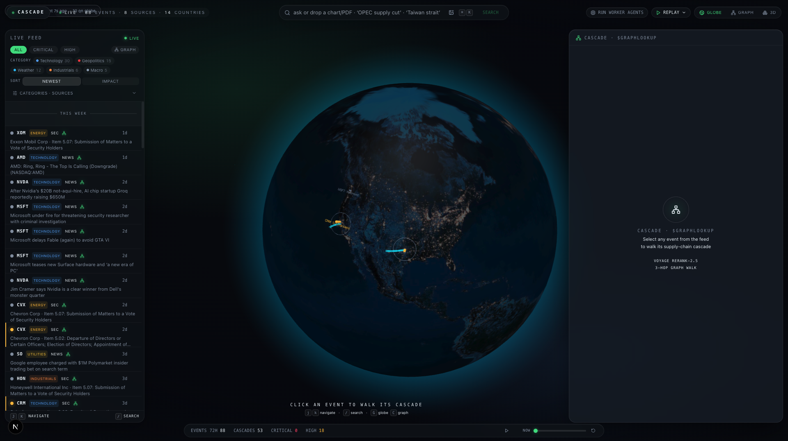
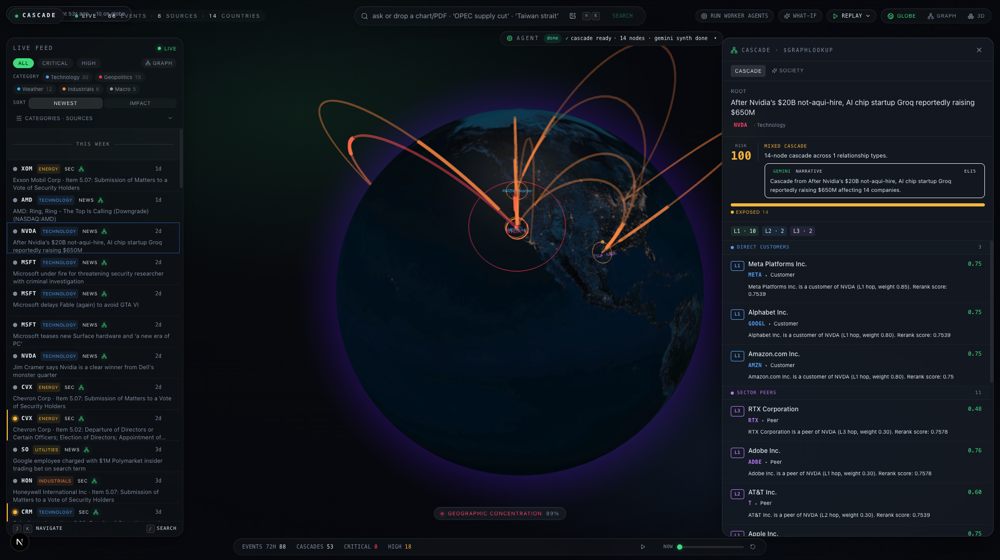
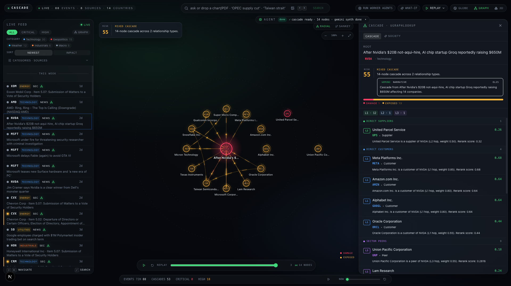
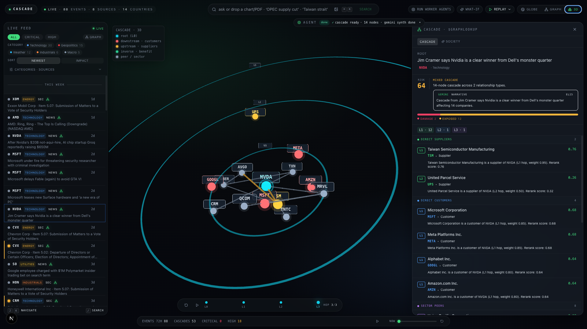
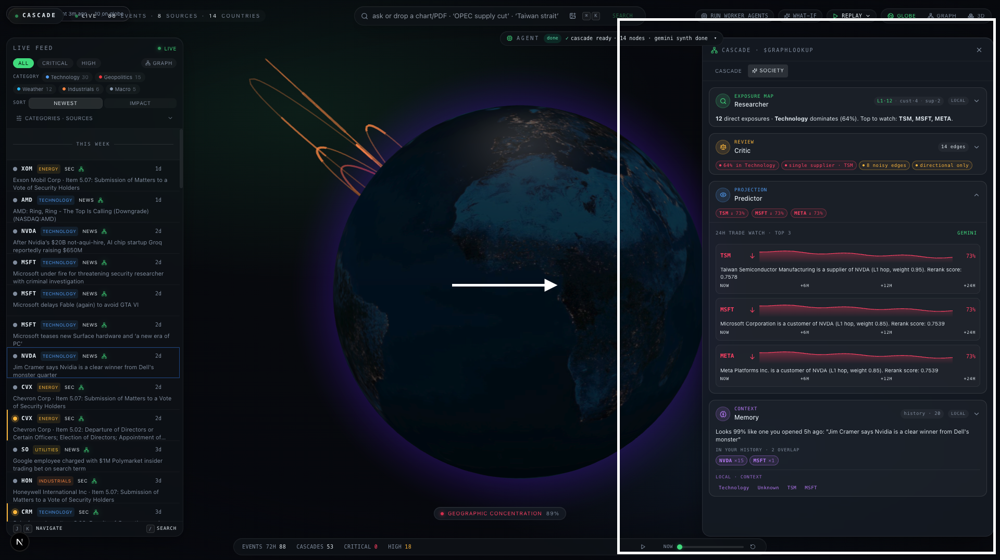
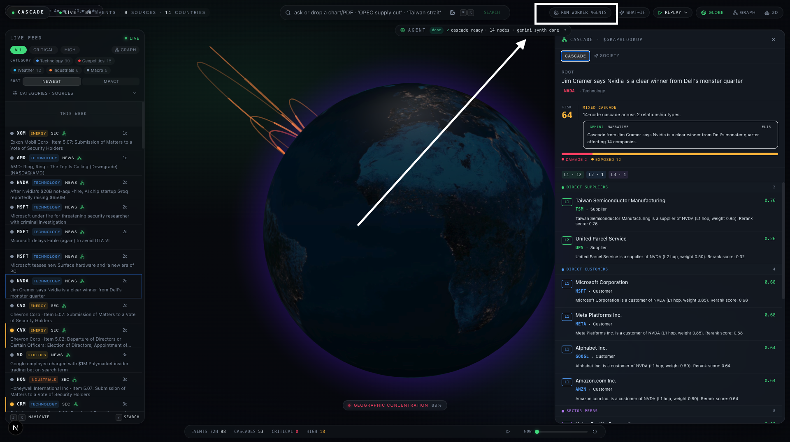
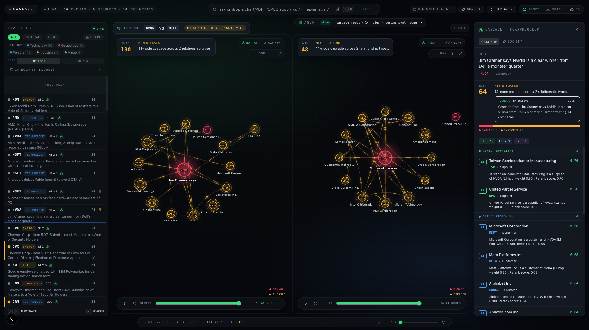
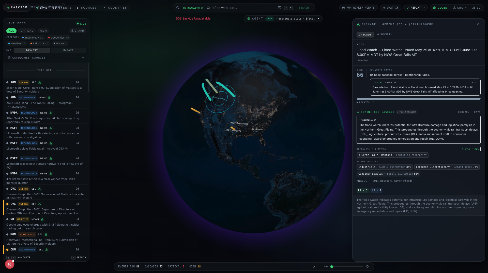

<div align="center">

# Cascade

### Real-time market intelligence with cascade reasoning.

When a single headline moves markets, Cascade tells you *which 30 stocks move next* — in seconds, not hours.

[**Live terminal →**](https://cascade-terminal.vercel.app) &nbsp;·&nbsp; [**Live API →**](https://cascade-api-527116913270.us-central1.run.app/health) &nbsp;·&nbsp; [**Demo video →**](#demo-video)


</div>

---

## The problem

A chip plant fire in Taiwan. An oil tanker stuck in the Red Sea. A Fed surprise. Within minutes, hundreds of stocks reprice. But the link between that headline and the *30 companies it's about to hit* lives in an analyst's head — scattered across Bloomberg terminals, Discord servers, SEC filings, and weather alerts. By the time a human stitches it together, the move is gone.

**Cascade is the missing connective tissue.** It ingests live news, filings, social signals, and price ticks into a single MongoDB Atlas cluster; walks supply-chain graphs in real time with `$graphLookup`; reranks impacted companies with Voyage `rerank-2.5`; and — for tickerless events like geopolitics, weather, and macro shocks — asks Gemini to infer the affected regions, sectors, and transmission mechanism, then plots structured coordinates onto a 3D globe.

One database. One agent. Every market shock visible the moment it happens.

---

## See it in 60 seconds

| Step | What to do | What you'll see |
|---|---|---|
| **1.** | Open [cascade-terminal.vercel.app](https://cascade-terminal.vercel.app) | A spinning 3D globe pulses with live events from the last hour. The left feed shows impact-colored headlines. The right rail is empty. |
| **2.** | Click any ticker-bearing event (NVDA, AAPL, TSM) | The right rail fills with a 3-hop cascade tree: L0 root → L1 suppliers/customers → L2 peers. Arcs animate between HQ locations on the globe. Each node has a one-line reasoning trace. |
| **3.** | Click a tickerless geopolitics or weather event | The new **Gemini Geo-Cascade panel** renders: regions, sector exposure, transmission mechanism, historical analog. The globe layers cyan rings on inferred coordinates + arcs to every affected company. A density toggle (`arcs · all → primary → off`) controls visual noise. |
| **4.** | Type *"AI capex shock semis"* in the search bar | Hybrid `$vectorSearch` + Atlas `$search`, fused with RRF, reranked by Voyage `rerank-2.5`. Top hits come back with their own cascades. |
| **5.** | Click **Agent Society** on any cascade | Three Gemini sub-agents (Critic, Predictor, Memory) reason in parallel about the cascade's weak spots, projected direction, and analog past events. |

No login. No setup. Just a URL.

---

## What's distinctive

These are the features judges should look at first.

### 🌐 Coordinate Mapping System (the new one)

When an event has no ticker — a geopolitical flare-up, a hurricane, a regulatory ruling — most terminals show nothing. Cascade asks Gemini 2.5 in JSON-mode to return a **structured impact hypothesis**: affected regions with geographic centroids (lat/lon), sector exposure with confidence, transmission mechanism in one sentence, and a historical analog. Coordinates are **server-side range-validated** (lat ∈ [-90, 90], lon ∈ [-180, 180], NaN/out-of-range dropped), then rendered as a distinct cyan layer on the globe — separate from the supply-chain `$graphLookup` arcs. Multi-region events get a `all / primary / off` density toggle so the globe never looks busy. See [agent/geo_cascade.py](agent/geo_cascade.py).

### 🕸️ `$graphLookup` cascade walk

Every cascade query runs a 3-hop graph traversal across supplier, customer, and peer edges — the killer MongoDB feature that vector-only chatbots can't match. See [agent/tools.py → build_cascade](agent/tools.py).

### 🧠 Agent Society (Critic, Predictor, Memory)

Beyond synthesis, three Gemini sub-agents reason in parallel about each cascade:
- **Critic** flags the weakest nodes in the rerank ordering
- **Predictor** projects direction + confidence for each top ticker with an analogue past event
- **Memory** consults the device's recent-cascade history to identify recurring themes

Each one degrades gracefully when Gemini times out — local fallback ensures the UI never blanks. See [agent/society.py](agent/society.py).

### 🔄 Live everything via change streams

No polling. New events flow Mongo → change stream → SSE → browser. The globe pulses a 3-second shockwave on arrival. Heartbeats detect stalled backends even when the connection is technically open. See [api/sse.py](api/sse.py).

### 📐 Hybrid search + Voyage rerank-2.5

Every search route fuses `$vectorSearch` (semantic) and `$search` (lexical) with Reciprocal Rank Fusion, then reranks with Voyage `rerank-2.5` cross-encoder. Free-tier rate-limit aware: degrades to RRF ordering when Voyage's 3-RPM cap bites. See [agent/tools.py → search_events](agent/tools.py).

---

## Architecture

```mermaid
flowchart TB
    subgraph INGEST["Ingestion pipeline"]
        direction TB

        subgraph SRC["External data sources"]
            direction LR
            S1[SEC EDGAR<br/>filings]
            S2[Marketaux<br/>news]
            S3[Alpha Vantage<br/>news + sentiment]
            S4[GDELT 2.0<br/>global events]
            S5[USGS<br/>earthquakes]
            S6[NOAA<br/>weather alerts]
            S7[OpenSky<br/>aviation]
            S8[yfinance<br/>OHLCV bars]
        end

        subgraph WORKERS["Worker agents · 8 Cloud Run Jobs · weekly"]
            direction LR
            WA1[sec-edgar agent]
            WA2[marketaux agent]
            WA3[alpha-vantage agent]
            WA4[gdelt agent]
            WA5[usgs agent]
            WA6[noaa agent]
            WA7[opensky agent]
            WA8[yfinance agent]
        end

        S1 --> WA1
        S2 --> WA2
        S3 --> WA3
        S4 --> WA4
        S5 --> WA5
        S6 --> WA6
        S7 --> WA7
        S8 --> WA8
    end

    subgraph ATLAS["MongoDB Atlas M0 · unified brain"]
        direction TB
        subgraph COLLS[" "]
            direction LR
            EV[("events<br/>tickers · sector · impact<br/>embedding 1024d · TTL 14d")]
            PR[("prices<br/>time-series")]
            REL[("relationships<br/>supplier · customer · peer")]
            CA[("cascades<br/>nodes · edges · cache")]
            CO[("companies<br/>top 100 + HQ")]
        end
        subgraph FEATS[" "]
            direction LR
            VIDX[/"Vector index<br/>cosine 1024d"/]
            TIDX[/"Atlas Search<br/>tickers · entities"/]
            AE[/"Auto-Embedding<br/>voyage-4 → text"/]
            GL{{"$graphLookup<br/>3-hop walk"}}
            CS{{"Change stream<br/>impact ≥ high"}}
        end
        EV --- VIDX
        EV --- TIDX
        EV --- AE
        EV --> CS
        REL --- GL
    end

    subgraph VOY["Voyage AI"]
        direction LR
        V1[voyage-4<br/>text queries]
        V2[voyage-multimodal-3.5<br/>chart + image]
        V3[voyage-rerank-2.5<br/>cross-encoder]
    end

    subgraph SOCIETY["Agent society · Gemini 3 · Google ADK · MongoDB MCP"]
        direction TB
        SYNTH["Cascade Synthesizer agent<br/>Gemini 3 Pro · hybrid search + $graphLookup"]
        subgraph SOC[" "]
            direction LR
            CRIT[Critic agent<br/>Gemini 3 Flash<br/>flag weak links]
            PRED[Predictor agent<br/>Gemini 3 Flash<br/>next-hop moves]
            MEM[Memory agent<br/>Gemini 3 Flash<br/>similar past cascades]
            ELI5[ELI5 agent<br/>Gemini 3 Flash<br/>novice rewrite]
        end
        SYNTH --> CRIT
        SYNTH --> PRED
        SYNTH --> MEM
        SYNTH --> ELI5
    end

    API["cascade-api · FastAPI REST + SSE · Cloud Run"]

    subgraph WEB["UI : Vercel · Next.js terminal"]
        direction LR
        STORE[Zustand store<br/>+ SSE client]
        GLOBE[3D Globe]
        FEED[Live feed]
        CASC[Cascade tree<br/>+ society panel]
    end

    USER(("Judge<br/>Trader"))

    WA1 -->|insert| EV
    WA2 -->|insert| EV
    WA3 -->|insert| EV
    WA4 -->|insert| EV
    WA5 -->|insert| EV
    WA6 -->|insert| EV
    WA7 -->|insert| EV
    WA8 -->|insert| PR
    WA2 -. hero image .-> V2

    API <-->|hybrid search| VIDX
    API <-->|hybrid search| TIDX
    API <--> PR
    API <--> CO
    API <-->|graph walk| GL
    API <--> CA
    CS --> API

    API <--> V1
    API <--> V3
    API <--> SYNTH
    SYNTH <-->|MCP tools| EV
    SYNTH <-->|graph walk| GL
    SYNTH <-->|lookup| CO
    SYNTH -->|cache| CA
    MEM <-->|vector recall| CA

    API -->|REST| STORE
    API -->|SSE| STORE
    STORE --> GLOBE
    STORE --> FEED
    STORE --> CASC

    USER --> GLOBE
    USER --> FEED
    USER --> CASC

    classDef src     fill:#FEF3C7,stroke:#B45309,stroke-width:1.5px,color:#78350F;
    classDef worker  fill:#DBEAFE,stroke:#1D4ED8,stroke-width:1.5px,color:#1E3A8A;
    classDef coll    fill:#D1FAE5,stroke:#047857,stroke-width:1.5px,color:#064E3B;
    classDef feat    fill:#A7F3D0,stroke:#0F766E,stroke-width:1.5px,color:#134E4A;
    classDef voyage  fill:#DDD6FE,stroke:#6D28D9,stroke-width:1.5px,color:#4C1D95;
    classDef agent   fill:#FBCFE8,stroke:#BE185D,stroke-width:1.5px,color:#831843;
    classDef api     fill:#E2E8F0,stroke:#1E293B,stroke-width:2.5px,color:#0F172A;
    classDef fe      fill:#A5F3FC,stroke:#0E7490,stroke-width:1.5px,color:#164E63;
    classDef user    fill:#1E293B,stroke:#020617,stroke-width:2px,color:#F8FAFC;

    class S1,S2,S3,S4,S5,S6,S7,S8 src;
    class WA1,WA2,WA3,WA4,WA5,WA6,WA7,WA8 worker;
    class EV,PR,REL,CA,CO coll;
    class VIDX,TIDX,AE,GL,CS feat;
    class V1,V2,V3 voyage;
    class SYNTH,CRIT,PRED,MEM,ELI5 agent;
    class API api;
    class STORE,GLOBE,FEED,CASC fe;
    class USER user;

    style INGEST  fill:#FFFFFF,stroke:#94A3B8,stroke-width:1.5px,color:#334155
    style SRC     fill:#FFFBEB,stroke:#FCD34D,stroke-width:1px,color:#78350F
    style WORKERS fill:#EFF6FF,stroke:#93C5FD,stroke-width:1px,color:#1E3A8A
    style ATLAS   fill:#ECFDF5,stroke:#6EE7B7,stroke-width:1px,color:#065F46
    style COLLS   fill:#FFFFFF00,stroke:#FFFFFF00
    style FEATS   fill:#FFFFFF00,stroke:#FFFFFF00
    style VOY     fill:#F5F3FF,stroke:#C4B5FD,stroke-width:1px,color:#5B21B6
    style SOCIETY fill:#FDF2F8,stroke:#F9A8D4,stroke-width:1px,color:#9D174D
    style SOC     fill:#FFFFFF00,stroke:#FFFFFF00
    style WEB     fill:#ECFEFF,stroke:#67E8F9,stroke-width:1px,color:#155E75
```



---

## MongoDB Atlas — every feature used

The strategic bet of this submission is **10+ distinct Atlas features in one cluster** — well beyond the typical vector-only chatbot.

| # | Feature | Where it lives | Why |
|---|---|---|---|
| 1 | `$vectorSearch` | [agent/tools.py](agent/tools.py) `search_events` | Semantic recall over event corpus (voyage-4, 1024-dim cosine) |
| 2 | Atlas Search `$search` | [agent/tools.py](agent/tools.py) `search_events` | Exact ticker / entity matching |
| 3 | Reciprocal Rank Fusion | [agent/tools.py](agent/tools.py) `search_events` | Fuse vector + text rankings before reranking |
| 4 | **`$graphLookup`** | [agent/tools.py](agent/tools.py) `build_cascade` | Walk supplier / customer / peer edges 3 hops |
| 5 | `$facet` | [agent/tools.py](agent/tools.py) `aggregate_stats` | Parallel sub-pipelines for dashboard counts |
| 6 | Time-series collection | `prices` ([scripts/setup_mongo.py](scripts/setup_mongo.py)) | Native OHLCV, minute granularity |
| 7 | TTL index | `events.published_at` (14 days) | Keeps M0 free tier under its 512 MB cap |
| 8 | Change streams | [api/sse.py](api/sse.py) | Push-based real-time updates to the browser via SSE |
| 9 | Atlas Automated Embedding | `events.text` (index-bound voyage-4) | No client-side embed call on insert path |
| 10 | Voyage `rerank-2.5` | [embed/rerank.py](embed/rerank.py) | Cross-encoder relevance for cascade ranking |
| 11 | `voyage-multimodal-3.5` | [embed/multimodal.py](embed/multimodal.py) | Embed charts + PDFs alongside text |
| 12 | MongoDB MCP server | [agent/](agent/) | The agent's hands into Atlas |
| 13 | Atlas Performance Advisor | [agent/tools.py](agent/tools.py) `optimize_self` | Agent → control-plane integration |

---

## Tech stack

**Frontend** — Next.js 15 App Router · TypeScript strict · Tailwind · react-globe.gl + three · framer-motion · Zustand · react-window virtual feed · SSE client · dark/light theme persistence

**Backend** — Python 3.11 · FastAPI · Motor (async Mongo) · Pydantic v2 · sse-starlette · change streams

**Agent** — Google Agent Development Kit (`google-adk`) · Gemini 3 Flash Preview (via AI Studio key / Vertex AI in prod) · MongoDB MCP server · custom ADK tool wrappers for hybrid search, graph cascade, geo-cascade hypothesis, agent society, prices, stats, self-optimisation

**Ingestion** — seven async workers in [workers/](workers/): SEC EDGAR 8-K · Finnhub WebSocket trades · Marketaux REST · yfinance OHLCV · Alpha Vantage RSI · Reddit (gated) · RSS (tech/industrial/energy)

**Hosting** — Vercel (web) · Cloud Run (api + agent) · MongoDB Atlas M0 · Voyage AI free tier · Gemini AI Studio free tier — **end-to-end on free tier**, $0 monthly run-rate

---

## Quick start (local dev)

Prereqs: Python 3.11+, Node 20+, a MongoDB Atlas cluster (M0 is fine), a Voyage AI key, a Gemini key.

```bash
git clone https://github.com/rajkamal2819/CascadeTerminal.git
cd CascadeTerminal

# Backend
python3 -m venv .venv && source .venv/bin/activate
pip install -e .
cp .env.example .env  # fill in MONGODB_URI, VOYAGE_API_KEY, GEMINI_API_KEY, SEC_USER_AGENT

# Provision Atlas (collections, vector + text indexes, TTL, time-series)
python -m scripts.setup_mongo
python -m scripts.seed_companies
python -m scripts.seed_relationships

# Ingest some events
python -m workers.sec_edgar --once
python -m workers.yfinance_ticks --once
python -m scripts.backfill_embeddings  # only needed if events landed before VOYAGE_API_KEY was set

# Run the API
uvicorn api.main:app --reload --port 8080

# In another shell — run the frontend
cd web && npm install && npm run dev
# → http://localhost:3000
```

Smoke-test the agent's tools directly (no LLM round-trips):

```bash
python -m scripts.test_tools
```

End-to-end query against the Gemini agent:

```bash
python -m agent.main "What is today's NVIDIA news and what tickers does it cascade to?"
```

---

## Repo layout

```
cascade/
├── web/                Next.js terminal UI
│   ├── app/            landing + /terminal
│   └── components/     Globe, Feed, Cascade, GeoCascadePanel, AgentTrace, …
├── api/                FastAPI + change-stream SSE
├── agent/              ADK agent + Gemini
│   ├── tools.py        search_events, build_cascade, get_company, prices, stats, optimize
│   ├── geo_cascade.py  Gemini 2.5 structured impact hypothesis (coordinate mapping)
│   ├── society.py      Critic + Predictor + Memory sub-agents
│   ├── prompts.py
│   └── cascade_reasoning.py
├── workers/            Seven async ingestion workers
├── embed/              Voyage wrappers (text, multimodal, rerank, NER)
├── scripts/            setup_mongo, seed_*, backfill_embeddings, test_tools
├── data/               companies.json, relationships.json (1149 edges)
└── pyproject.toml
```

---

## Demo video

📺 **Watch the 3-minute walkthrough → [youtu.be/Cpi3ZEuo8GA](https://youtu.be/Cpi3ZEuo8GA)**

Covers the problem, the live terminal in motion, and the Atlas walkthrough showing `$graphLookup` + vector indexes + change streams in action.

<div align="center">

[](https://youtu.be/Cpi3ZEuo8GA)

</div>

---

## Screenshots

<div align="center">

**Landing**


**Terminal overview — live feed (left), 3D globe (center), cascade rail (right)**


**Click NVDA → globe arcs animate to supplier / customer / peer HQs**


**Cascade graph (2D) — three hops out from the NVDA root**


**Cascade graph (3D) — same cascade, alternate spatial view**


**Agent Society — Critic / Predictor / Memory / ELI5 reasoning in parallel**


**Worker runner — manually trigger any of the 8 ingestion agents**


**Compare mode — pin two events, render both cascades side by side**


**Tickerless event — Gemini Geo-Cascade panel with regions, sectors, transmission mechanism**


</div>

---

## Status

| Phase | Title | State |
|---|---|---|
| 0 | Repository scaffolding | ✅ |
| 1 | MongoDB schemas, indexes, seed data | ✅ |
| 2 | Async ingestion workers | ✅ |
| 3 | Voyage embeddings · NER · backfill | ✅ |
| 4 | Google ADK agent — 6 tools, `$graphLookup`, rerank-2.5 | ✅ |
| 5 | FastAPI backend + change-stream SSE | ✅ |
| 6 | Next.js terminal UI (globe, feed, cascade panel) | ✅ |
| 7 | Polish · seed demo · deploy · submit | 🟡 in progress |
| 7.5 | Innovation pass — Agent Society, multimodal, 3D cascade | ✅ |
| 7.6 | Geo-Cascade + Coordinate Mapping System | ✅ |

---

## License

[Apache-2.0](LICENSE).

---

## Acknowledgements

Built with [Gemini](https://ai.google.dev/), [Google Cloud Agent Builder](https://cloud.google.com/products/agent-builder), the [MongoDB MCP server](https://www.mongodb.com/docs/atlas/data-api/mcp/), and [Voyage AI](https://www.voyageai.com/) embeddings + rerankers.

---

<div align="center">

*Cascade — one database, one agent, every market shock visible the moment it happens.*

</div>
